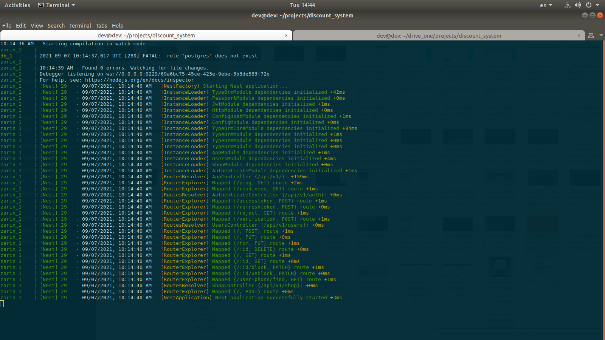
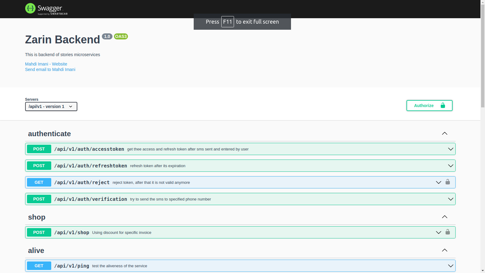
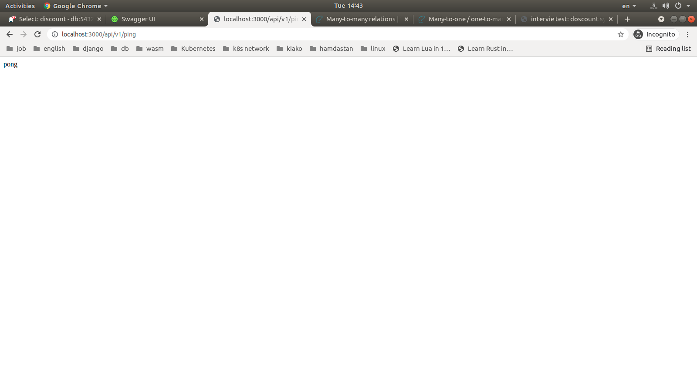

# Discount service

## Prerequsits

### Create schema in db

Creating `schema` in db `zarin-staging` by name `zarin`


## Development

### Start

```bash
docker-compose up
```

### Stop project

```bash
docker-compose down --rmi local --remove-orphans
docker volue prune
```


## Usage

### Check server health

```bash
curl -s http://localhost:3000/api/v1/ping
```

### Runing docker-compose


### Database schema


### Swagger


### Ping endpint



## Documentation

### Swagger API

url: `http://localhost:3000/api`
