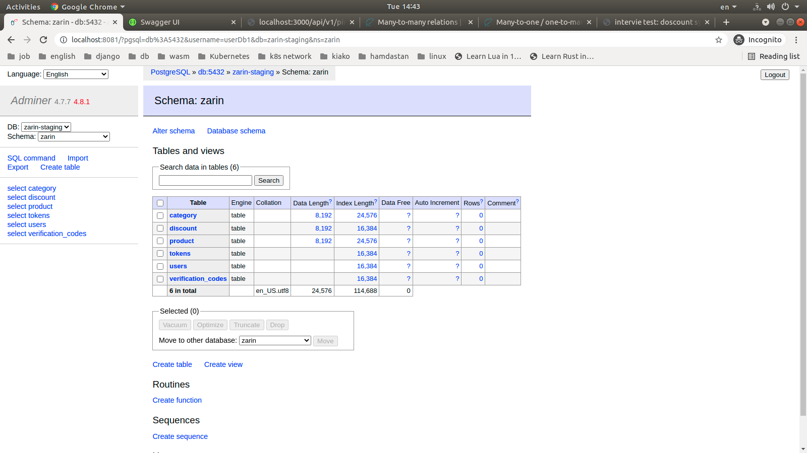

# Discount service

## Prerequsits

### Create schema in db

Creating `schema` in db `zarin-staging` by name `zarin`


## Development

### Start

```bash
docker-compose up
```

### Stop project

```bash
docker-compose down --rmi local --remove-orphans
docker volue prune
```


## Usage

### Check server health

Check that system being online
```bash
curl -s http://localhost:3000/api/v1/ping
```
Check 
```bash
curl --silent -XPOST localhost:3000/api/v1/shop/discount \
  --header "Content-Type: application/json" \
  --data '{"userId": "1c6c1a48-b2ab-40ce-bb47-708214cb6449", "discountCode":"h983y4hv", "productId": "c1fe23f7-a3b7-4e71-b757-242aa09630a5"}' | jq
```


### Runing docker-compose


### Database schema


### Swagger


### Ping endpint


## Documentation

### Swagger API

url: `http://localhost:3000/api`
